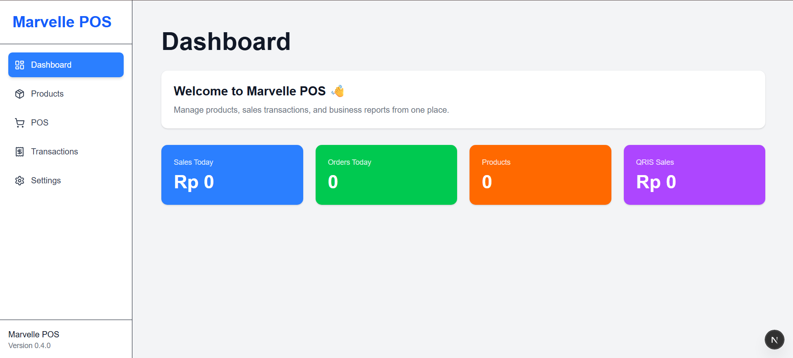
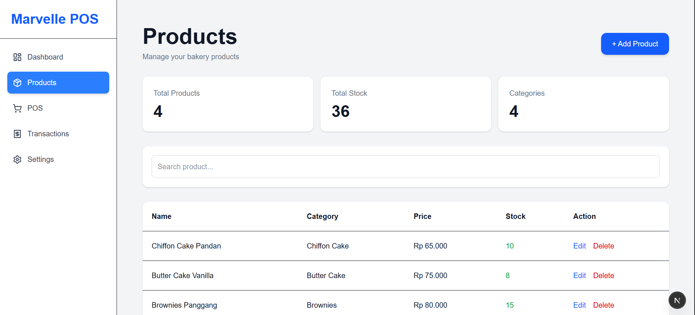
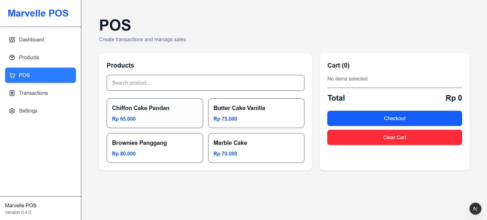
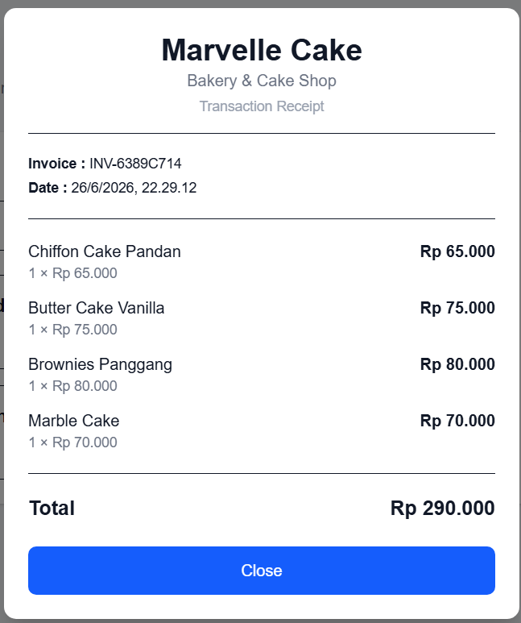

# <p align="center">Marvelle POS</p>

<p align="center">
  
</p>

<p align="center">
Modern Point of Sale (POS) System for Bakery & Cake Shop<br>
Built with <b>Next.js</b>, <b>TypeScript</b>, and <b>Tailwind CSS</b>.
</p>

---

# 📖 Overview

Marvelle POS adalah aplikasi Point of Sale modern yang dirancang khusus untuk membantu operasional toko roti dan bakery seperti **Marvelle Cake**.

Fokus utama project ini adalah membangun sistem POS yang cepat, sederhana, modern, dan mudah dikembangkan.

---

# ✨ Features

### Current Features

- 📊 Dashboard
- 📦 Product Management
- 🛒 Point of Sale (POS)
- 🔍 Product Search
- ➕ Quantity Counter
- 🧾 Receipt Generation
- 🧹 Clear Cart
- 🗑 Remove Item
- 🔢 Unique Invoice Number

---

# 📸 Screenshots

## Dashboard



---

## Products



---

## POS



---

## Receipt

## 

# 🚀 Tech Stack

## Frontend

- Next.js 15
- React
- TypeScript
- Tailwind CSS

---

## Backend (Planned)

- Next.js Server Actions
- Prisma ORM

---

## Database (Planned)

- SQLite (v0.5.0)
- PostgreSQL (Future)

---

# 📈 Project Status

| Item            | Status     |
| --------------- | ---------- |
| Current Version | **v0.4.0** |
| Development     | Active     |
| Progress        | **55%**    |

Progress

```
███████████░░░░░░░░░░ 55%
```

---

# 🗺 Roadmap

## ✅ v0.1.0 — Project Initialization

- [x] Setup Git Repository
- [x] Initialize Next.js
- [x] Configure TypeScript
- [x] Configure TailwindCSS
- [x] Initial Documentation

---

## ✅ v0.2.0 — Dashboard Module

- [x] Dashboard Layout
- [x] Sidebar Navigation
- [x] Statistics Cards
- [x] Navigation Menu

---

## ✅ v0.3.0 — Product Module

- [x] Product Management
- [x] Product Statistics
- [x] Product Search
- [x] Product CRUD Layout

---

## 🚧 v0.4.0 — POS Module

- [x] Product Selection
- [x] Shopping Cart
- [x] Product Search
- [x] Quantity Counter
- [x] Remove Item
- [x] Clear Cart
- [x] Auto Total Calculation
- [x] Checkout Process
- [x] Receipt Popup
- [x] Unique Invoice Number
- [ ] Print Receipt
- [ ] Payment Method

---

## ⏳ v0.5.0 — Database Integration

Planned

- [ ] SQLite
- [ ] Prisma ORM
- [ ] Product Database
- [ ] Transaction Database
- [ ] Inventory Management
- [ ] Persistent Data

---

## 🎯 v1.0.0 — Stable Release

- [ ] Dashboard Analytics
- [ ] Sales Charts
- [ ] Reports
- [ ] Customer Management
- [ ] Authentication
- [ ] QRIS Integration
- [ ] Export PDF
- [ ] Export Excel

---

# ⚙️ Installation

Clone repository

```bash
git clone https://github.com/systemzerodev/marvelle-pos-system.git
```

Install dependencies

```bash
npm install
```

Run development server

```bash
npm run dev
```

Open

```
http://localhost:3000
```

---

# 📂 Project Structure

```
Marvelle-POS-System
│
├── app/
├── components/
├── design/
├── public/
├── README.md
├── LICENSE
└── package.json
```

---

# 📝 Changelog

## v0.4.0

### Added

- POS Module
- Shopping Cart
- Product Search
- Quantity Control
- Receipt Popup
- Invoice Generator
- Clear Cart
- Remove Item

### Improved

- Better POS Layout
- Improved User Experience
- Better Receipt Design

---

# 🎯 Upcoming

Next milestone (**v0.5.0**)

- SQLite Database
- Prisma ORM
- Persistent Products
- Persistent Transactions
- Inventory System

---

# 📄 License

This project is licensed under the **MIT License**.

---

# 👨‍💻 Author

**SystemZeroDev**

Built with ❤️ using Next.js, TypeScript and Tailwind CSS.

---

<p align="center">
⭐ If you like this project, don't forget to give it a star!
</p>
